<!-- ╔══════════════════════════════════════════════════════════════════╗ -->
<!-- ║              HARSH KUMAR — GITHUB PROFILE README               ║ -->
<!-- ║         ULTRA-ANIMATED • CINEMATIC • PRODUCTION GRADE           ║ -->
<!-- ╚══════════════════════════════════════════════════════════════════╝ -->

<div align="center">

<!-- ━━━━━━━━━━━━━━━━━ ANIMATED WAVING HERO HEADER ━━━━━━━━━━━━━━━━━ -->
<a href="https://github.com/Harsh06045">
  
</a>

<!-- ━━━━━━━━━━━━━ MULTI-LINE ANIMATED TYPING INTRO ━━━━━━━━━━━━━━━ -->


<br/>

<!-- ━━━━━━━━━━━━━━━━━━━ ANIMATED WAVE HAND ━━━━━━━━━━━━━━━━━━━━━━━ -->


&nbsp;


&nbsp;


<br/><br/>

<!-- ━━━━━━━━━━━━━━ ANIMATED SOCIAL BADGES ROW ━━━━━━━━━━━━━━━━━━━ -->

<a href="https://www.linkedin.com/in/harsh-k-95327927a">
  
</a>
<a href="mailto:harsh.kumar60456@gmail.com">
  
</a>
<a href="https://github.com/Harsh06045">
  
</a>
<a href="tel:+917862816335">
  
</a>

<br/>


&nbsp;

&nbsp;


</div>

<!-- ━━━━━━━━━━━━━━━ ANIMATED RAINBOW DIVIDER ━━━━━━━━━━━━━━━━━━━━ -->


<!-- ━━━━━━━━━━━━━━━━━━ ANIMATED MOTTO BAR ━━━━━━━━━━━━━━━━━━━━━━━ -->
<div align="center">

### ⚡ `LEARN • BUILD • DEBUG • IMPROVE • REPEAT` ⚡


</div>


<!-- ╔══════════════════════════════════════════════════════════════╗ -->
<!-- ║                      ABOUT ME                               ║ -->
<!-- ╚══════════════════════════════════════════════════════════════╝ -->

<div align="center">

##  ABOUT ME



</div>

<br/>

```ts
const harsh = {
  name      : "Harsh Kumar",
  location  : "📍 Anand, Gujarat — 388001",
  E-mail    : "📞 harsh.kumar60456@gmail.com",

  roles: [
    "☕ Java Developer",
    "🧩 DSA Enthusiast — 300+ Problems Solved",
    "🌐 MERN Full-Stack Developer",
    "🤖 AI / ML Enthusiast"
  ],

  education: {
    degree      : "🎓 BE in Computer Science Engineering",
    university  : "🏛️ Sathyabama Institute of Science & Technology",
    location    : "📍 Jeppiaar Nagar, Chennai",
    cgpa        : "⭐ 8.40 / 10.00",
    batch       : "📅 2023 – 2027"
  },

  experience: {
    current : "💼 Freelance Web Developer (Jan 2024 – Present)",
    focus   : "⚙️ Full-stack client projects • React.js & Node.js",
    deploy  : ["☁️ Vercel", "☁️ Render"]
  },

  achievements: [
    "🏆 Hackathon Winner — Innovator's Hackathon (Team of 5)",
    "🚀 Represented institution at Startup Fest 2025",
    "🎨 Design Team Leader — Mathematics Club, Sathyabama"
  ],

  streaks: {
    codeChef : "🔥 200+ Days Active Streak",
    leetCode : "🔥 150+ Days Active Streak"
  },

  philosophy: "Learn → Build → Debug → Improve → Repeat ♾️"
};
```

<br clear="right"/>


<!-- ╔══════════════════════════════════════════════════════════════╗ -->
<!-- ║                     TECH ARSENAL                             ║ -->
<!-- ╚══════════════════════════════════════════════════════════════╝ -->

<div align="center">

##  TECH ARSENAL


<br/>

### 💻 Languages & Core CS


<br/>


<br/><br/>

### 🎨 Frontend


<br/>


<br/><br/>

### ⚙️ Backend & APIs


<br/>


<br/><br/>

### 🗄️ Databases


<br/><br/>

### 🛠️ DevOps & Tools


</div>


<!-- ╔══════════════════════════════════════════════════════════════╗ -->
<!-- ║                   CERTIFICATIONS                             ║ -->
<!-- ╚══════════════════════════════════════════════════════════════╝ -->

<div align="center">

##  CERTIFICATIONS & TRAINING

<br/>


<br/>


<br/>


</div>


<!-- ╔══════════════════════════════════════════════════════════════╗ -->
<!-- ║                    DSA JOURNEY                               ║ -->
<!-- ╚══════════════════════════════════════════════════════════════╝ -->

<div align="center">

##  DSA JOURNEY — 300+ PROBLEMS SOLVED

<br/>


<br/>

<!-- DSA Topic Badges Grid -->


<br/><br/>

<!-- Platform Stats -->

&nbsp;

&nbsp;


</div>


<!-- ╔══════════════════════════════════════════════════════════════╗ -->
<!-- ║                   FEATURED PROJECTS                          ║ -->
<!-- ╚══════════════════════════════════════════════════════════════╝ -->

<div align="center">

##  FEATURED PROJECTS


</div>

<br/>

<table width="100%">
<tr>

<td width="50%" valign="top">

<div align="center">

</div>

<br/>

Full-stack AI platform for **Alzheimer's disease prediction** using Explainable AI & Grad-CAM.

<p>


</p>

- 🧠 Alzheimer's disease prediction engine
- 🔬 **Grad-CAM** Explainable AI visualizations
- 👨‍⚕️ Doctor, Patient & Admin **RBAC dashboards**
- 📊 Deep learning model integration

</td>

<td width="50%" valign="top">

<div align="center">

</div>

<br/>

Centralized healthcare ecosystem — **showcased at Startup Fest 2025** to industry leaders.

<p>


</p>

- 🩸 Blood donation management system
- 🩻 **AI diagnostics** — X-ray & report analysis
- 📷 Biometric patient enrollment
- 💊 Automated medicine reminders
- 🏠 Home hemodialysis support

</td>

</tr>
<tr>

<td width="50%" valign="top">

<div align="center">

</div>

<br/>

Full-stack online LMS with **Stripe payment integration** and personalized dashboards.

<p>


</p>

- 📚 Course catalog & enrollment engine
- 💳 **Secure Stripe** payment checkout
- 👤 Personalized student dashboards
- ⚡ Vite-powered blazing fast frontend

</td>

<td width="50%" valign="top">

<div align="center">

</div>

<br/>

Intelligent **Retrieval-Augmented Generation** applications with vector search.

<p>


</p>

- 📄 Contextual document question answering
- ⚡ High-performance **FAISS** vector search
- 🔍 Embedding-based similarity indexing
- 🧠 LangChain orchestration pipeline

</td>

</tr>
</table>


<!-- ╔══════════════════════════════════════════════════════════════╗ -->
<!-- ║                    PROFILE SUMMARY                           ║ -->
<!-- ╚══════════════════════════════════════════════════════════════╝ -->

<div align="center">

##  GITHUB PROFILE OVERVIEW


<br/><br/>

<!-- Achievement Badges -->


</div>


<!-- ╔══════════════════════════════════════════════════════════════╗ -->
<!-- ║                   GITHUB STATISTICS                          ║ -->
<!-- ╚══════════════════════════════════════════════════════════════╝ -->

<div align="center">

##  GITHUB STATISTICS

<br/>

<!-- Row 1: Stats + Streak -->

&nbsp;


<br/><br/>

<!-- Row 2: Top Languages -->


</div>


<!-- ╔══════════════════════════════════════════════════════════════╗ -->
<!-- ║                  CONTRIBUTION GRAPH                          ║ -->
<!-- ╚══════════════════════════════════════════════════════════════╝ -->

<div align="center">

## 📈 CONTRIBUTION HEATMAP


<br/><br/>


</div>


<!-- ╔══════════════════════════════════════════════════════════════╗ -->
<!-- ║                 CONTRIBUTION SNAKE & HEATMAP                 ║ -->
<!-- ╚══════════════════════════════════════════════════════════════╝ -->

<div align="center">

## 🐍 CONTRIBUTION SNAKE

<picture>
  <source
    media="(prefers-color-scheme: dark)"
    srcset="https://raw.githubusercontent.com/Harsh06045/Harsh06045/output/github-contribution-grid-snake-dark.svg"
  />
  <source
    media="(prefers-color-scheme: light)"
    srcset="https://raw.githubusercontent.com/Harsh06045/Harsh06045/output/github-contribution-grid-snake.svg"
  />
  
</picture>

</div>


<!-- ╔══════════════════════════════════════════════════════════════╗ -->
<!-- ║             3D CONTRIBUTION & COMMIT ANALYTICS               ║ -->
<!-- ╚══════════════════════════════════════════════════════════════╝ -->

<div align="center">

## 🧊 COMMIT ANALYTICS & PRODUCTIVE TIME


&nbsp;


</div>


<!-- ╔══════════════════════════════════════════════════════════════╗ -->
<!-- ║              ACHIEVEMENTS & LEADERSHIP                       ║ -->
<!-- ╚══════════════════════════════════════════════════════════════╝ -->

<div align="center">

## 🏆 ACHIEVEMENTS & LEADERSHIP

<br/>

<table>
<tr>
<td align="center" width="150">

<br/><br/>
<b>Innovator's<br/>Hackathon</b>
<br/><sub>Team of 5</sub>
</td>
<td align="center" width="150">

<br/><br/>
<b>Startup Fest<br/>2025</b>
<br/><sub>BloodCare</sub>
</td>
<td align="center" width="150">

<br/><br/>
<b>Design Team<br/>Lead</b>
<br/><sub>Math Club</sub>
</td>
<td align="center" width="150">

<br/><br/>
<b>CodeChef<br/>Streak</b>
<br/><sub>Active Days</sub>
</td>
<td align="center" width="150">

<br/><br/>
<b>LeetCode<br/>Streak</b>
<br/><sub>Active Days</sub>
</td>
<td align="center" width="150">

<br/><br/>
<b>DSA Problems<br/>Solved</b>
<br/><sub>LC + GFG</sub>
</td>
</tr>
</table>

</div>


<!-- ╔══════════════════════════════════════════════════════════════╗ -->
<!-- ║                   CURRENTLY LEARNING                         ║ -->
<!-- ╚══════════════════════════════════════════════════════════════╝ -->

<div align="center">

##  CURRENTLY LEARNING


</div>


<!-- ╔══════════════════════════════════════════════════════════════╗ -->
<!-- ║                     SYSTEM STATUS                            ║ -->
<!-- ╚══════════════════════════════════════════════════════════════╝ -->

<div align="center">

## 🟧 SYSTEM STATUS


<br/>


&nbsp;

&nbsp;


</div>


<!-- ╔══════════════════════════════════════════════════════════════╗ -->
<!-- ║                   CONNECT WITH ME                            ║ -->
<!-- ╚══════════════════════════════════════════════════════════════╝ -->

<div align="center">

##  LET'S CONNECT & COLLABORATE

<br/>

<a href="https://www.linkedin.com/in/harsh-k-95327927a"></a>
&nbsp;&nbsp;
<a href="mailto:harsh.kumar60456@gmail.com"></a>
&nbsp;&nbsp;
<a href="https://github.com/Harsh06045"></a>
&nbsp;&nbsp;
<a href="tel:+917862816335"></a>

<br/><br/>


</div>

<!-- ━━━━━━━━━━━━━━━━━ ANIMATED WAVING FOOTER ━━━━━━━━━━━━━━━━━━━━ -->

<div align="center">


</div>
